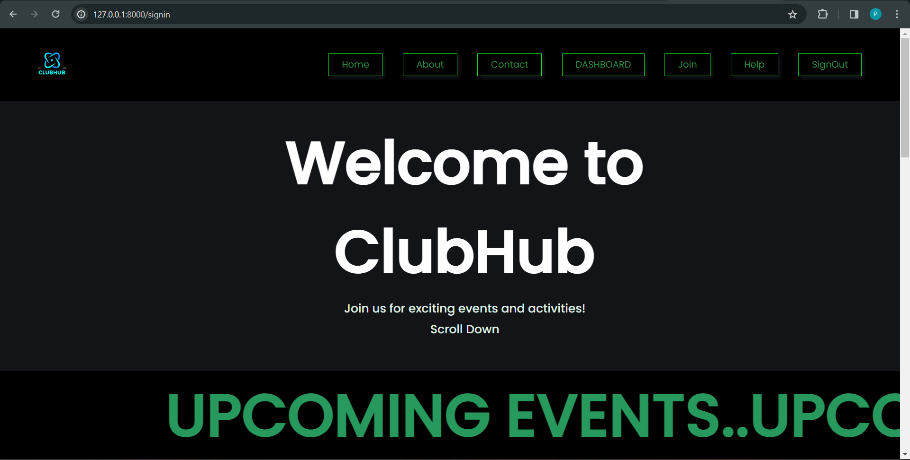
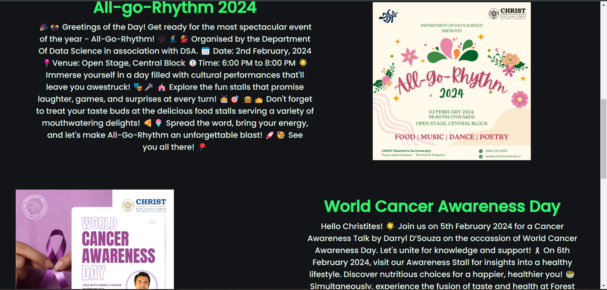
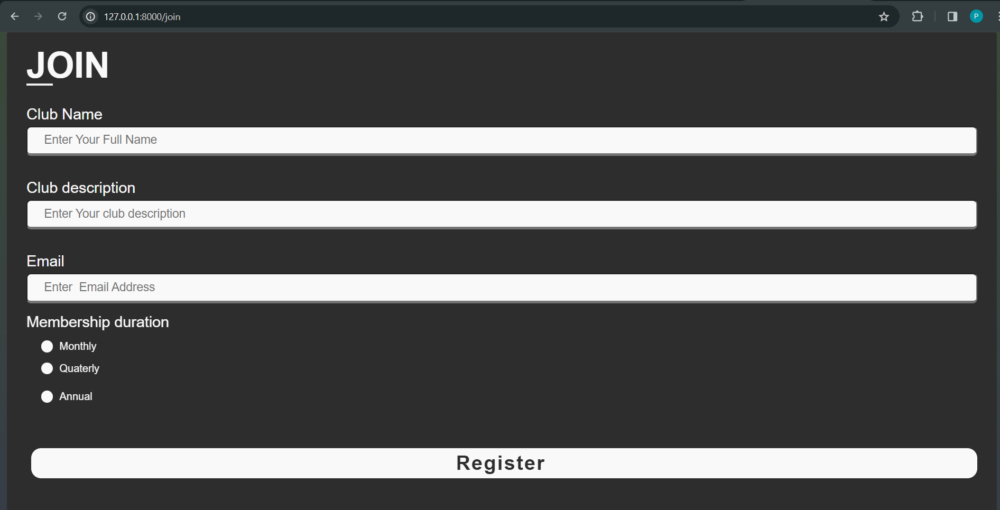
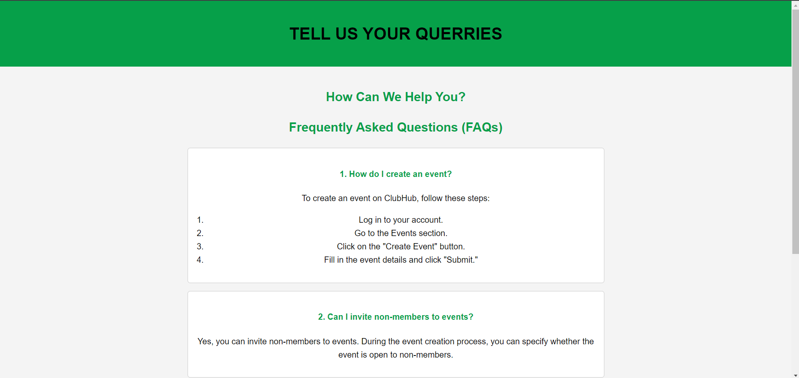
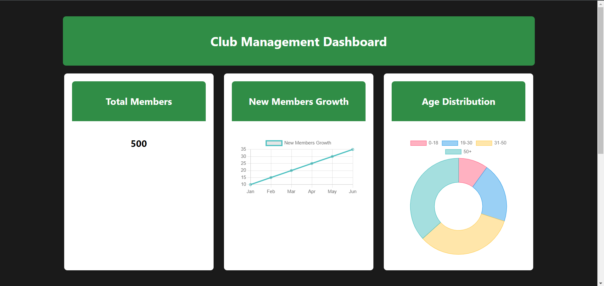
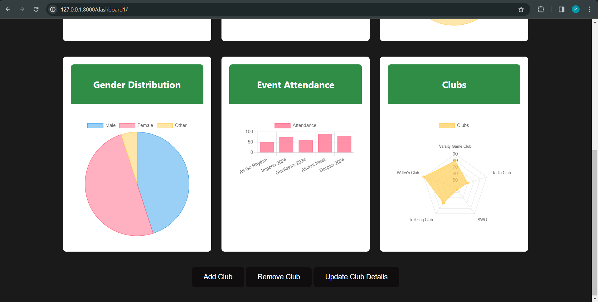

# django_CAC_2

# Club Management App

Welcome to the Club Management App! This application is designed to help clubs efficiently manage their members, events, and overall activities.

The **Club Management Project** is a web application built with Django, tailored for efficiently managing a club's members, events, and generating insightful statistics. This project offers a user-friendly interface to handle member details, and visualize club data through an interactive dashboard.

## Features

### Member Management

Effortlessly manage club members by adding, updating, and deleting member information. The system allows for the input of various details such as name, age, gender, and more.

### Event Management

Organize and oversee club events with ease. This feature facilitates the creation, tracking, and management of events, including monitoring attendance and participation.

### Interactive Dashboard

The dashboard serves as a central hub for obtaining valuable insights into club activities. It provides real-time statistics and charts for key metrics, including total members, new members' growth, age distribution, gender distribution, event attendance, and member skills.

## Getting Started

To set up the project locally, follow these steps:

1. Clone the repository to your machine.
2. Install project dependencies.
3. Run database migrations.
4. Create a superuser for admin access.
5. Start the development server.

### Prerequisites

- Python and Django

### Installation

1. Clone this repository:

   ```bash
   git clone https://github.com/your-username/club-management-app.git

After completing these steps, access the application in your browser and navigate to the admin panel to manage members and events. The interactive dashboard is accessible at [http://127.0.0.1:8000/dashboard/](http://127.0.0.1:8000/dashboard/).

## Usage

- **Member Management:** Use the admin panel to add and manage club members.
- **Event Management:** Organize and track events through the admin panel.
- **Dashboard:** Explore and analyze club data by visiting the dashboard.

## Functionalities

1. **Add:**
   - Allows administrators or authorized users to add new clubs, members, events, or other relevant entities to the system.

2. **Update:**
   - Enables users to modify existing information for clubs, members, events, or other data entries in the system.

3. **Delete:**
   - Permits authorized users to remove clubs, members, events, or other records from the system.

4. **Join:**
   - Allows clubs to join or register to the system.

## Images for Usage

1) **Homepage: Displaying upcoming events**






2) **Join Us Page**



3) **Help**



4) **Dashboard**





   
## **GROUP MEMBERS:**

**1) Leran Anthony Carvalho (23122021)**

**Email: leran.carvalho@msds.christuniversity.in**

**2) Parul Sharma (23122026)**

**Email: parul.sharma@msds.christuniversity.in**

**3) Sukanna Das (23122039)**

**Email: sukanna.das@msds.christuniversity.in**


